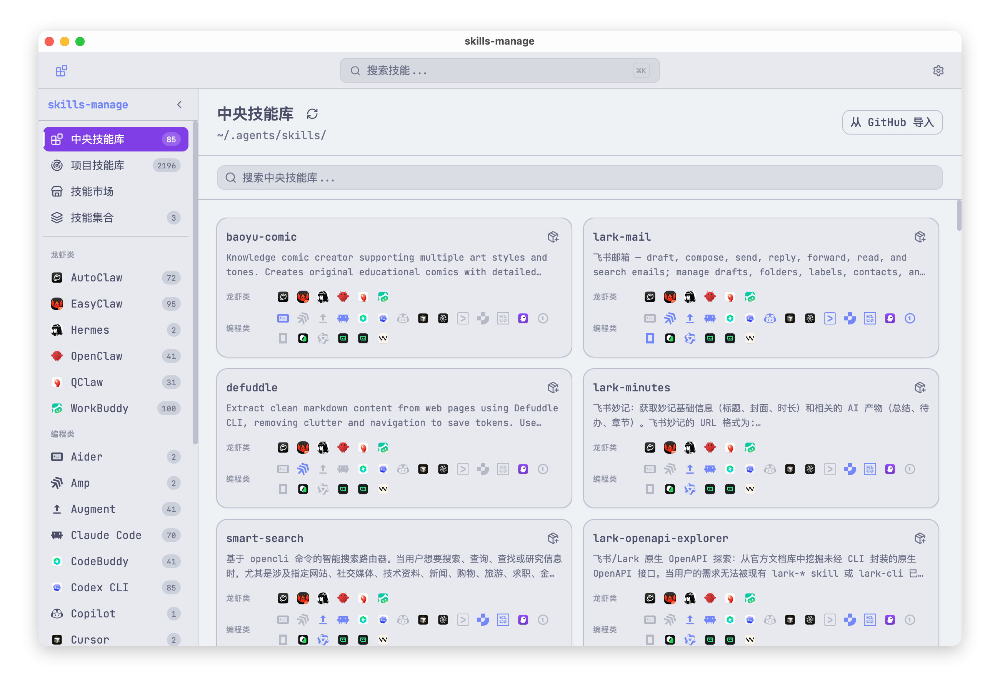
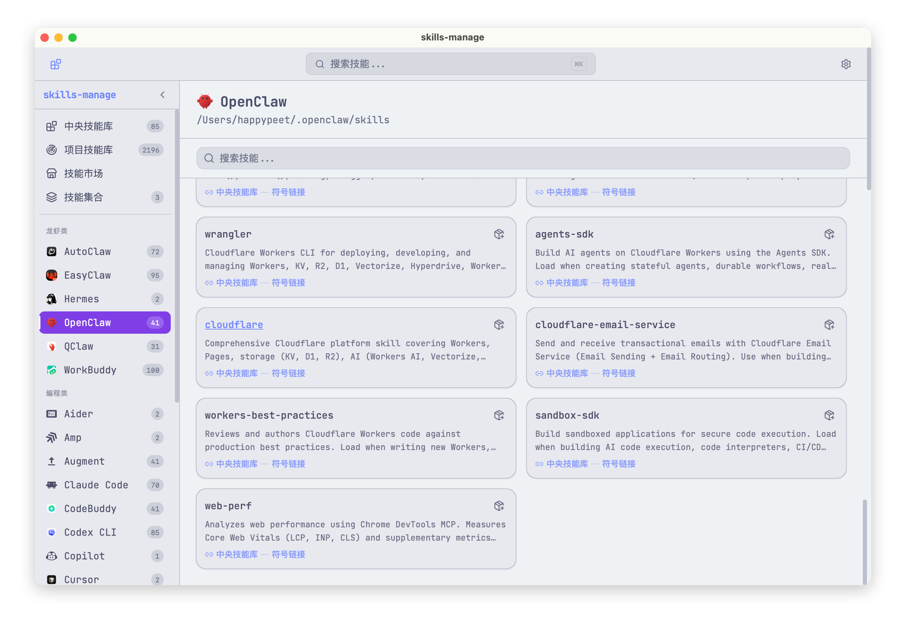
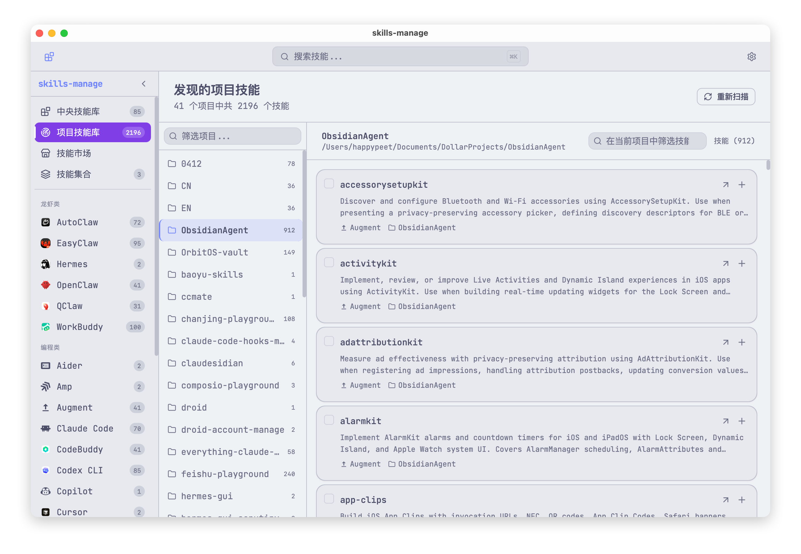
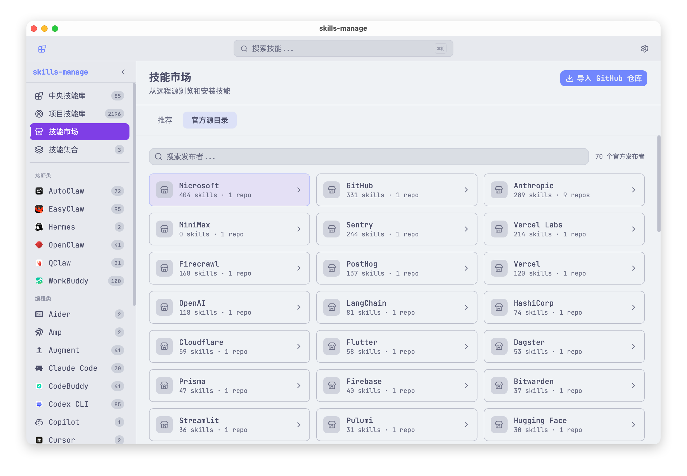
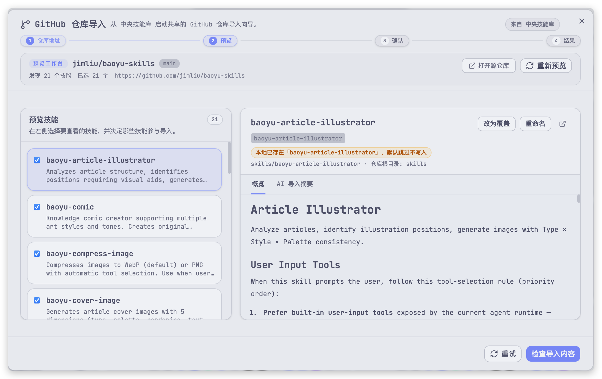
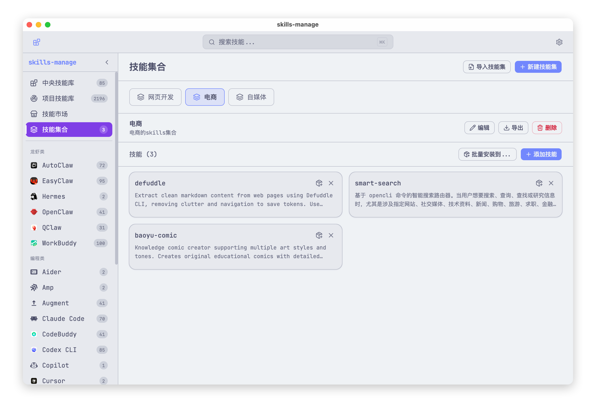

# skills-manage

`skills-manage` is a Tauri desktop app for managing AI coding agent skills across multiple platforms from one place.

`skills-manage` 是一个基于 Tauri 的桌面应用，用来在一个界面里统一管理多平台 AI coding agent skills。

> **Disclaimer / 免责声明**
>
> `skills-manage` is an independent, unofficial desktop application for managing local skill directories and importing public skill metadata. It is not affiliated with, endorsed by, or sponsored by Anthropic, OpenAI, GitHub, MiniMax, or any other supported platform, publisher, or trademark owner.
>
> `skills-manage` 是一个独立的非官方桌面应用，用于管理本地 skill 目录并导入公开 skill 元数据。它与 Anthropic、OpenAI、GitHub、MiniMax 或其他受支持平台、发布方、商标所有者均无隶属、背书或赞助关系。

## Overview / 项目简介

`skills-manage` follows the [Agent Skills](https://github.com/anthropics/agent-skills) open pattern and uses `~/.agents/skills/` as the canonical central directory. Skills can then be installed to individual platforms through symlinks, so one source of truth can drive multiple AI coding tools.

`skills-manage` 遵循 [Agent Skills](https://github.com/anthropics/agent-skills) 的开放模式，使用 `~/.agents/skills/` 作为中央 canonical 目录，再通过符号链接把 skill 安装到各个平台，让同一份 skill 成为多个 AI coding 工具的单一事实来源。

## Highlights / 核心能力

- Central skill library plus per-platform installs and uninstall flows.  
  中央技能库与按平台安装、卸载工作流。
- Full skill detail view with Markdown preview, raw source view, and AI explanation generation.  
  完整技能详情视图，支持 Markdown 预览、原始源码查看和 AI 解释生成。
- Collections for organizing skills and batch-installing them to platforms.  
  通过技能集合整理和批量安装 skills。
- Discover scan for project-level skill libraries on local disks.  
  支持扫描本地项目级 skill 库的 Discover 能力。
- Marketplace browsing and GitHub repository import with authenticated requests and retry fallback.  
  支持 marketplace 浏览，以及带鉴权请求和重试回退的 GitHub 仓库导入。
- Fast search for large skill libraries with deferred queries, lazy indexing, and virtualization.  
  通过延迟查询、懒加载索引和虚拟列表提升大规模 skill 库搜索体验。
- Bilingual UI, Catppuccin themes, accent colors, onboarding, and responsive navigation.  
  提供中英文界面、Catppuccin 主题、强调色、首次引导和响应式导航。

## Screenshots / 项目截图

### Central skills and platform installs / 中央技能库与平台安装



### Review installed skills on a specific platform / 查看特定平台的已安装技能



### Discover local project skill libraries / 扫描本地项目技能库



### Browse marketplace publishers and skills / 浏览 marketplace 发布者与技能



### Import skills from a GitHub repository / 从 GitHub 仓库导入技能



### Organize reusable collections / 管理可复用技能集合



## Download / 下载

- Latest release / 最新发布：<https://github.com/iamzhihuix/skills-manage/releases/latest>
- Current prebuilt packages / 当前已提供的预编译安装包：Apple Silicon macOS (`.dmg` and `.app.zip`)
- Other platforms / 其他平台：run from source for now / 当前请从源码运行

### macOS Unsigned Build / macOS 未签名构建说明

The current public macOS build is not notarized. If macOS shows a warning such as:

当前公开发布的 macOS 安装包还没有 notarization。如果 macOS 提示：

- `"skills-manage" is damaged and can't be opened`
- `"skills-manage" cannot be opened because Apple could not verify it`

the app is usually not actually corrupted; it is being blocked by Gatekeeper quarantine on an unsigned build.

这通常不代表安装包真的损坏，而是未签名应用被 Gatekeeper 的 quarantine 机制拦截。

After moving the app to `/Applications`, run:

把应用移动到 `/Applications` 后，执行：

```bash
xattr -dr com.apple.quarantine "/Applications/skills-manage.app"
```

Then launch the app again from Finder.

然后回到 Finder 再次打开应用。

If your app is stored somewhere else, replace the path with the actual `.app` path.

如果你的应用不在 `/Applications`，把命令中的路径替换成实际 `.app` 路径即可。

## Supported Platforms / 支持的平台

| Category / 类别 | Platform / 平台 | Skills Directory / Skills 目录 |
|----------------|-----------------|--------------------------------|
| Coding | Claude Code | `~/.claude/skills/` |
| Coding | Codex CLI | `~/.agents/skills/` |
| Coding | Cursor | `~/.cursor/skills/` |
| Coding | Gemini CLI | `~/.gemini/skills/` |
| Coding | Trae | `~/.trae/skills/` |
| Coding | Factory Droid | `~/.factory/skills/` |
| Coding | Junie | `~/.junie/skills/` |
| Coding | Qwen | `~/.qwen/skills/` |
| Coding | Trae CN | `~/.trae-cn/skills/` |
| Coding | Windsurf | `~/.windsurf/skills/` |
| Coding | Qoder | `~/.qoder/skills/` |
| Coding | Augment | `~/.augment/skills/` |
| Coding | OpenCode | `~/.opencode/skills/` |
| Coding | KiloCode | `~/.kilocode/skills/` |
| Coding | OB1 | `~/.ob1/skills/` |
| Coding | Amp | `~/.amp/skills/` |
| Coding | Kiro | `~/.kiro/skills/` |
| Coding | CodeBuddy | `~/.codebuddy/skills/` |
| Coding | Hermes | `~/.hermes/skills/` |
| Coding | Copilot | `~/.copilot/skills/` |
| Coding | Aider | `~/.aider/skills/` |
| Lobster | OpenClaw (开爪) | `~/.openclaw/skills/` |
| Lobster | QClaw (千爪) | `~/.qclaw/skills/` |
| Lobster | EasyClaw (简爪) | `~/.easyclaw/skills/` |
| Lobster | EasyClaw V2 | `~/.easyclaw-20260322-01/skills/` |
| Lobster | AutoClaw | `~/.openclaw-autoclaw/skills/` |
| Lobster | WorkBuddy (打工搭子) | `~/.workbuddy/skills-marketplace/skills/` |
| Central | Central Skills | `~/.agents/skills/` |

Custom platforms can be added through Settings.

也可以在 Settings 中添加自定义平台。

## Privacy & Security / 隐私与安全

- Local-first storage: metadata, collections, scan results, settings, and cached AI explanations stay in `~/.skillsmanage/db.sqlite` or the local skill directories you manage.  
  本地优先：元数据、集合、扫描结果、设置和 AI explanation 缓存都保存在 `~/.skillsmanage/db.sqlite` 或你自己管理的本地 skill 目录中。
- No telemetry: the app does not include analytics, crash reporting, or usage tracking.  
  无遥测：应用不包含分析、崩溃上报或使用追踪。
- Network access is feature-driven: outbound requests only happen when you explicitly use marketplace sync/download, GitHub import, or AI explanation generation.  
  网络访问由功能触发：只有在你显式使用 marketplace 同步/下载、GitHub 导入或 AI explanation 时才会发起外部请求。
- Credentials are stored locally: GitHub PAT and AI API keys are kept in the local SQLite settings table and are not encrypted at rest by the app.  
  凭据仅本地存储：GitHub PAT 和 AI API key 会保存在本地 SQLite settings 表中，应用本身不提供静态加密。
- Never post real secrets in issues, pull requests, screenshots, or logs.  
  不要在 issue、PR、截图或日志里公开真实密钥。

## Tech Stack / 技术栈

| Layer / 层 | Technology / 技术 |
|------------|-------------------|
| Desktop framework | Tauri v2 |
| Frontend | React 19, TypeScript, Tailwind CSS 4 |
| UI components | shadcn/ui, Lucide icons |
| State management | Zustand |
| Markdown | react-markdown |
| i18n | react-i18next, i18next-browser-languagedetector |
| Theming | Catppuccin 4-flavor palette |
| Backend | Rust (serde, sqlx, chrono, uuid) |
| Database | SQLite via sqlx (WAL mode) |
| Routing | react-router-dom v7 |

## Development / 开发

### Prerequisites / 前置依赖

- [Node.js](https://nodejs.org/) (LTS)
- [pnpm](https://pnpm.io/)
- [Rust toolchain](https://rustup.rs/) (stable)
- Tauri v2 system dependencies / Tauri v2 系统依赖：<https://v2.tauri.app/start/prerequisites/>

### Install Dependencies / 安装依赖

```bash
pnpm install
```

### Run in Development / 启动开发环境

```bash
pnpm tauri dev
```

The Vite dev server runs on port `24200`.

Vite 开发服务器默认使用 `24200` 端口。

### Validation / 验证命令

```bash
pnpm test
pnpm typecheck
pnpm lint
cd src-tauri && cargo test
cd src-tauri && cargo clippy -- -D warnings
```

## Project Structure / 项目结构

```text
skills-manage/
├── src/                        # React frontend
│   ├── components/             # UI components
│   ├── i18n/                   # Locale files and i18n setup
│   ├── lib/                    # Frontend helpers
│   ├── pages/                  # Route views
│   ├── stores/                 # Zustand stores
│   ├── test/                   # Vitest + RTL tests
│   └── types/                  # Shared TypeScript types
├── src-tauri/                  # Rust backend
│   └── src/
│       ├── commands/           # Tauri IPC handlers
│       ├── db.rs               # SQLite schema, migrations, queries
│       ├── lib.rs              # Tauri app setup
│       └── main.rs             # Desktop entry point
├── public/                     # Static assets
├── CHANGELOG.md                # English changelog
├── CHANGELOG.zh.md             # 中文更新日志
└── release-notes/              # GitHub release notes
```

## Database / 数据库

The SQLite database lives at `~/.skillsmanage/db.sqlite` and is initialized automatically on first launch.

SQLite 数据库位于 `~/.skillsmanage/db.sqlite`，首次启动时会自动初始化。

## Changelog / 更新日志

- English: [CHANGELOG.md](CHANGELOG.md)
- 中文：[CHANGELOG.zh.md](CHANGELOG.zh.md)

## Contributing / 参与贡献

See [CONTRIBUTING.md](CONTRIBUTING.md) for development setup, validation commands, and pull request expectations.

开发环境、验证命令和 PR 约定见 [CONTRIBUTING.md](CONTRIBUTING.md)。

## Security / 安全报告

See [SECURITY.md](SECURITY.md) for vulnerability reporting and data-handling notes.

漏洞反馈和数据处理说明见 [SECURITY.md](SECURITY.md)。

## License / 许可证

This project is licensed under the Apache License 2.0. See [LICENSE](LICENSE).

本项目使用 Apache License 2.0，详见 [LICENSE](LICENSE)。
